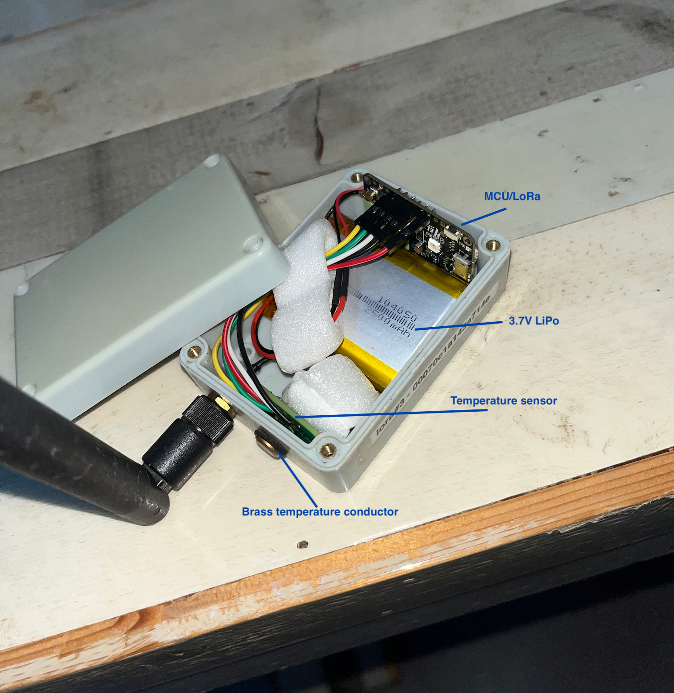
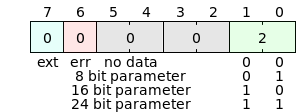
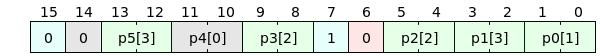

# LoRa Sensor Node

2026 Update: 4 temperature sensor nodes were build and deployed in 2022, inside our home and
on our 2.3ha property. Overall they worked quite well -still do-, although the radio connection
isn't very reliable. That's mainly because one node is programmed to serve as a
"poor man's gateway". It's connected via serialUSB to an old 2010 Mac mini running a tiny script
uploading data packets to PHP/MySQL (and Node.js/Postres) doing the data processing.  

 

## Low power, high accuracy temperature sensor LoRa node

Temperature is measured every 15 minutes and broadcast via a LoRa transceiver. Sensor node hardware:

- BlueDot TMP117 sensor board (no longer available). Use a better alternative: [Adafruit TMP117](https://www.adafruit.com/product/4821?srsltid=AfmBOoq--AR38QMIiaH3DP2tLxGJdLStaPRV6gN7Z23IPMsg9kn7z4i6)
- Arduino compatible [Heltec CubeCell AB01](https://heltec.org/project/htcc-ab01-v2/) board with ASR650x MCU/LoRa module
  (PSoC 4100S Plus and Semtech SX1262 LoRa transceiver). This project is made with Version 1.2 board.

Power-save considerations:

- only send data when changed since the last measurement;
- keep hardware components in sleep/idle mode when not used;
- use LoRa MAC layer instead of full LoRaWAN protocol for radio communications (dramatic reduction of time on air)

Signal wiring between BlueDot TMP117 sensor board and Heltec CubeCell AB01 dev board:  
&nbsp;&nbsp;&nbsp;BlueDot TMP117 I2C &larr;&rarr; AB01 SDA/SCL  
&nbsp;&nbsp;&nbsp;BlueDot TMP117 Alert &rarr; AB01 GPIO0

### Operation

An interval timer wakes up the MPU every 15 minutes to trigger a sensor conversion.
The TMP117 data ready signal wakes up the MPU to read the sensor data, encode the data into payload packet format and transmit
it via the LoRa transceiver.
When no sensor data ready was received at the start of the next cycle, an error will be sent.

### TMP117 - TMP117 sensor driver 'Lite'

TMP117 Lite provides basic functionality for temperature measurements at minimal power usage.
It is inspired by the [TMP117-Arduino](https://github.com/NilsMinor/TMP117-Arduino) implementation by Nils Minor.

**Features:**

- Keeps track of actual, minimum and maximum temperature
- Minimum and maximum temperatures are stored in the sensor's EEPROM
- Temperature data available after a One-Shot conversion
- Power-On Reset (POR) setting for production use
- Using shutdown mode for minimal power consumption
- Temperature Offset adjustment
- Error detection:
  - No sensor data received
  - EEPROM write failure

#### Using on board multi-color led module

The on board multi-color led module provides program status using red, green or blue colored lights.
The led module should be disabled when it is not observed, which is usually the case.

It can be enabled/disabled in the App configuration header.

During TMP117 Power-On Reset initialization, the led colors indicate the following:   
blue (single flash): TMP117 initialization in progress 
green (steady): TMP initialization successfully stored in EEPROM  
red (steady): TMP117 initialization could not be stored in EEPROM

During normal operation:  
red: error condition occured  
green: data acquisition in progress  
blue: packet transmission in progress  
Each color should only be visible as a short flash (> 200ms).

### Payload - LoRa transmission payload

Variable length payload encoding is used to reduce time-on-air and transmission energy.  

A payload sequence contains a data header followed by sensor data, or an error header.
Errors where normal operation is likely compromized are sent when they are detected. Others are stored until sensor data is sent and then prefixed to the data header.

A header specifies what data is transmitted. Headers are 1 to 4 bytes long, depending on the number and size of the data parameters. There are two types of headers:

- Data headers
-  1 to 4 bytes
 - Allow dynamic parameter passing (eg. only include data that has changed)
 - One-, two- or three-byte parameter encoding
 - Up to 12 parameter values
 - Min/max payload: 2 to 40 bytes
- Error headers (1 byte):
 - 1 byte
 - Can be followed by a 1-3 byte parameter value
 - Min/max payload: 1 to 4 bytes

  

#### 1. Data header

A data header has ERR bit [6:6] set to 0. The example below shows a data header for sending a single, 2-byte parameter:

  

When the EXT-bit [7:7] is set, the header is extended with the next payload byte. Parameter fields may thus span multiple bytes in the data header.
A Parameter Identifier (PID) represents all parameter fields in the data header. Bits [7:6] of each PID-byte are zero. Example of a 16-bit PDE data header:  

Parameter payload sequence of this PID: `<p0[7:0]> <p1[7:0]><p1[15:8]><p1[23:16]> <p2[7:0]><p2[15:8]> <p3[7:0]><p3[15:8]> <p5[7:0]><p5[15:8]><p5[23:16]>`  
Note that parameter p4 is not present.

#### 2. Error header

An error header consists of a 1-byte header with ERR-bit [6:6] set to 1. Other fields are a 4-bit error code field, a 2-bit error extension field and an EXT [7:7] bit.

When the ERR-bit [6:6] is set, the PDE contains 4 error flags [3:0], and a 2-bit extension size field [5:4]. The extension size field indicates the number of bytes following the error header. The extension bytes are used to indicate faulty sensors.

When the error header EXT [7:7] bit is 0, no other payload is present after the error message: the total payload consists of the error header and optional error extension data bytes.
These error messages are sent immediately after the error is detected.

When the EXT [7:7] bit is 1, transmission of the error message is postponed until the next regular data transmission. By combining the error message with regular data, the tranmission overhead is reduced. This is only possible when the device's normal operation is not compromized by the error.

A faulty sensor will cause a sensor time-out condition and a 'no data' error being issued. The error won't be sent until the next data transmission, which may take until a heart-beat is sent after 24h when there is no data to be sent.

Here an example of an error with a 1-byte extension, followed by a regular data header and 3 data bytes:  

### Implementation details

Some errors must be sent out immediately: WDT and PROT faults, and also UNKNOWN errors.
It makes no sense to buffer these because normal operation may be compromized and also the direct transmission may already fail.
Direct transmission of WDT errors can cause a potential violation of the transmission duty-cycle regulations:
WDT error causes a system reset after appr. 4 seconds, after which the error is detected and sent and then resets itself again after 4s. No precautions are taken to avoid this: it's the user's responsibility to act on errors as they occur, in this case by taking the node down as soon as possible.

### Adding Sensor Modules

To add a sensor module, do the following:

1. implement the following functions in your sensor driver:
   1. void InitMySensor(..., &sensorCount, MySensorReady[, Error])
        Initialize the MySensor HW and driver
   3. void StartMySensor(void)
        Start measurement/conversion cycle of the sensor; this function should return immediately and not wait until the sensor is ready
   4. 'MySensorData_t' ReadMySensorData(..., &sensorDataClrOnRead)
        Reads the sensor data and clears its status bit in the sensorDataClrOnRead when the read was successful

In the App, implement the following:

1. Add a parameter description to sensor_t nodeData[] for each parameter to be included in the payload data:
   - { ['parameter \#'] = { raw : 0, idx : 'parameter #', sz : 'data size in byte [1,...,3]', pos : 'parameter byte offset in payload data*' },
   - To make this a bit easier and more readible, enumerated constants can be used (see: PARAM in sensor-app.h).
   - Note that parameter descriptions in nodeData must be sequential!
2. In setup(), place a call to your InitSensor(..., &sensorCount, MySensorReady[, Error]) function;
3. In StartSensors(), place a call to your StartMySensor(void) function;
4. Add a function void MySensorReady(void) which:
   - Calls ReadMysSensorData(..., &sensorDataClrOnRead) to get the data from MySensor and forward it to the Packet handler;
   - For each data item to be transmitted/uploaded:
      - Call Packet.addSensorPar(nodeData['item']);
      - Put data in nodeData['item'].raw.

\*) First payload parameter *par1* has offset 0 (pos: 0), *par2* comes at pos: 0 + sz(*par1*), *par[n]* pos: 0 + pos(*par1*) + ... + sz(*par[n-1]*).
   See also examples above.
